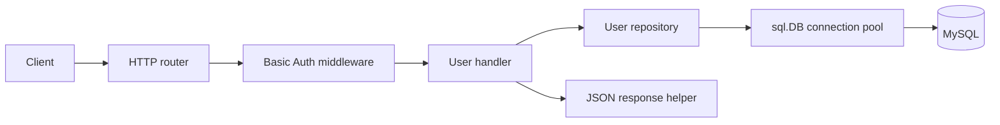

# Architecture

## Overview

The application uses Go's standard `net/http` package and separates HTTP handling from data access. MySQL runs through Docker Compose, while the Go server runs locally and connects through the MySQL connection pool.



Every registered route passes through Basic Authentication before reaching a user handler.

## Project structure

| Path | Responsibility |
| --- | --- |
| `cmd/server/main.go` | Loads configuration, opens the database pool, registers routes, and starts the HTTP server. |
| `internal/middleware` | Checks HTTP Basic Authentication credentials. |
| `internal/handler` | Parses requests, validates input, maps errors to HTTP statuses, and writes responses. |
| `internal/model` | Defines the user and user-input data structures. |
| `internal/repository` | Executes parameterized MySQL queries for user persistence. |
| `internal/response` | Provides consistent JSON success and error encoding. |
| `migrations` | Creates the MySQL `users` table and uniqueness constraints. |
| `openapi.yaml` | Describes the public API contract using OpenAPI 3.0. |

## Request flow

1. `http.ServeMux` matches the HTTP method and path.
2. Basic Auth middleware validates the configured username and password for `/users` routes.
3. The handler parses path parameters or a JSON request body.
4. The handler validates the user ID and user data before calling the repository.
5. The repository executes a parameterized query through `sql.DB`.
6. The handler converts the result or error into an appropriate JSON HTTP response.

The handler depends on a small `UserRepository` interface rather than directly on MySQL. This keeps HTTP behavior isolated and allows handler tests to use an in-memory stub.

## Authentication

Basic Authentication is applied to every `/users` operation. The server reads credentials from `BASIC_AUTH_USERNAME` and `BASIC_AUTH_PASSWORD`. Missing or incorrect credentials produce `401 Unauthorized`, a `WWW-Authenticate` header, and a JSON error body.

Authentication only verifies access to the API. Role-based access control is outside the current scope.

## Validation

Handlers validate request data before calling the repository. The shared JSON decoder rejects malformed bodies, unknown fields, and trailing JSON values. Path IDs must be positive integers.

POST and PUT decode into `UserInput`, so all user fields are required. PATCH decodes into `UserPatch`, whose pointer fields distinguish a supplied value from an omitted field. At least one non-nil patch field is required, and only supplied fields are validated.

An explicit JSON `null` also decodes to a nil pointer, so it is currently treated like an omitted field. A request containing only null user fields is rejected as an empty patch. The exact input constraints are defined in `openapi.yaml`.

## Persistence

The `users` table contains an auto-incrementing `id`, `username`, `email`, and `age`. Unique indexes on `username` and `email` prevent duplicate users. Repository queries use placeholders rather than string interpolation.

The server configures the shared `sql.DB` pool with:

- 10 maximum open connections
- 5 maximum idle connections
- 5-minute maximum connection lifetime

Database connectivity is verified during startup with a five-second timeout. Startup stops immediately if configuration is missing or MySQL cannot be reached.

### Partial updates

The PATCH repository uses `COALESCE` to update only supplied values:

```sql
UPDATE users
SET username = COALESCE(?, username),
    email = COALESCE(?, email),
    age = COALESCE(?, age)
WHERE id = ?
```

For an omitted patch field, Go passes a nil pointer through the database driver as SQL `NULL`. `COALESCE(NULL, column)` returns the existing column value. For a supplied field, the first argument is non-null, so `COALESCE(value, column)` returns the new value.

For example, an age-only patch sends SQL arguments equivalent to `NULL, NULL, 35, id`. Username and email keep their existing values while age becomes 35. The repository then retrieves and returns the complete updated user.

## Error handling

API errors are returned as JSON:

```json
{
  "error": "User not found"
}
```

Repository errors are translated at the handler boundary. Missing rows become `404 Not Found`, MySQL duplicate-key errors become `409 Conflict`, invalid client input becomes `400 Bad Request`, and unexpected database failures become `500 Internal Server Error` without exposing internal details.

## API contract and testing

`openapi.yaml` is the authoritative HTTP contract and defines the Basic Auth scheme, operations, inputs, output schemas, examples, and error responses. Handler tests cover successful requests, validation failures, missing users, duplicate users, and unexpected repository errors. Middleware tests cover valid, missing, and invalid credentials.
